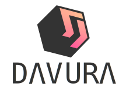

# DΛVURΛ  

    

### Davura is a library / framework developed for the creation of web-component that is compiled automatically within the browser or can be compiled completely in a single file. Davura can help the development of applications or SPA websites in a simpler way.

 

# Check the complete documentation in the following link
# [https://davura.github.io/](https://davura.github.io/)